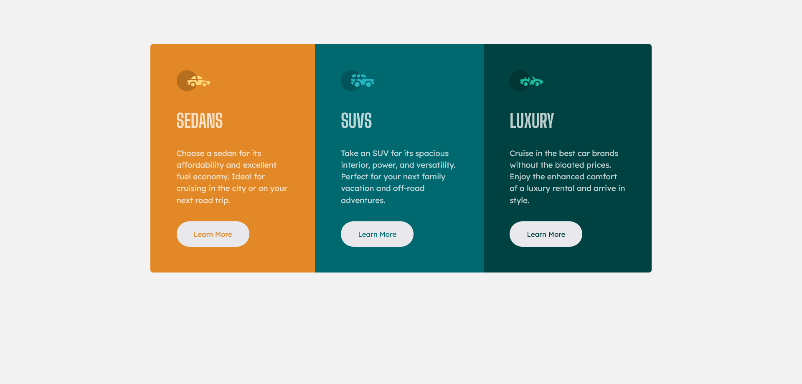

# Frontend Mentor - 3-column preview card component solution

This is a solution to the [3-column preview card component challenge on Frontend Mentor](https://www.frontendmentor.io/challenges/3column-preview-card-component-pH92eAR2-). Frontend Mentor challenges help you improve your coding skills by building realistic projects. 

## Table of contents

- [Overview](#overview)
  - [The challenge](#the-challenge)
  - [Screenshot](#screenshot)
  - [Links](#links)
- [My process](#my-process)
  - [Built with](#built-with)
  - [What I learned](#what-i-learned)
  - [Continued development](#continued-development)
- [Author](#author)

## Overview
 
 Three column cards layout created with plain HTML and CSS

### The challenge

Users should be able to:

- View the optimal layout depending on their device's screen size
- See hover states for interactive elements

### Screenshot

### Links

- Solution URL: [here](https://github.com/pilatech/three-column-preview-card)
- Live Site URL: [here](https://three-column-cards-by-pilate.netlify.app/)

## My process
 - Create Markup getting inspiration from the desktop layout. Concerning myself with semantic without totally disregarding visual layout.
 - Create CSS, targetting mobile first 
 - Create Media Queries for larger devices

### Built with

- Semantic HTML5 markup
- CSS custom properties
- Flexbox
- Mobile-first workflow

### What I learned

Bem naming can make your styles reusable

### Continued development

Keep on doing plain HTML and CSS projects for a while

## Author

- Frontend Mentor - [@pilatech](https://www.frontendmentor.io/profile/pilatech)
- Twitter - [@pchinyengetere](https://www.twitter.com/pchinyengetere)
